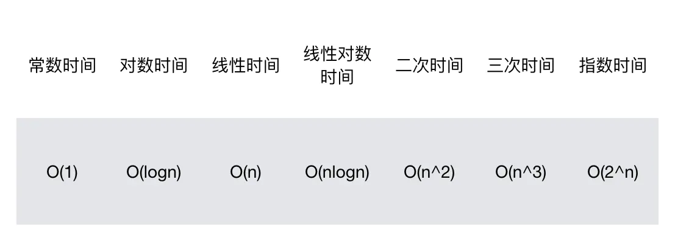

---
tags:
  - algorithm
---

# 算法性能
评价算法的能力的两个纬度：
* 时间复杂度
* 空间复杂度

## 时间复杂度
算法的时间复杂度反映的不是算法的逻辑代码到底被执行了多少次，而是**随着输入规模的增大，算法对应的执行总次数的一个变化趋势**。一般对 `T(n)` 做如下处理实现从 计算 `T(n)` -> 推导 `O(n)`

* 若 `T(n)` 是常数，那么无脑简化为 `1`
* 若 `T(n)` 是多项式如 `3n^2 + 5n + 3`，我们**只保留次数最高那一项**，并且将其常数系数无脑改为 `1`

```js
function traverse(arr) {
    const len = arr.length
    for(let i=0;i<len;i++) {
        console.log(arr[i])
    }
}
```

以上代码计算机执行运算的步骤
* 函数里的第一行代码 `const len = arr.length`，它只会被执行 `1` 次
* 循环体 `console.log(arr[i])` 在 for 循环跑了 `n` 次，因此这条语句就会被执行 `n` 次
    * 其中初始化语句 `let i = 0` 只有执行了 `1` 次
    * 其中判断语句 `i < len` 执行的次数就是 `n+1` 次。有个规律是**在所有的 for 循环里，判断语句都会比递增语句多执行一次**。
    * 其中递增语句 `i++` 被执行 `n` 次

将总的执行次数记为 `T(n)`，以上实例代码执行的次数为：`T(n) = 1 + n + 1 + (n+1) + n = 3n + 3`，然后通过简化处理得到算法的时间复杂度

```
T(n) = 10
O(n) = 1

T(n) = 3n^2 + 5n + 3
O(n) = n^2
```

此外我们一般只要直接抓主要矛盾实现目测得到算法的 `O(n)` 值，就可以衡量算法在数据规模变化时时间复杂度了

```js
// 对于循环只需要关心其最内层那个循环体被执行多少次就行了

// 规模为 n 的一维数组遍历时，最内层的循环会执行 n 次，其对应的时间复杂度是 O(n)
function traverse1(arr) {
    const len = arr.length
    for(let i=0;i<len;i++) {
        console.log(arr[i])
    }
}

// 规模为 n*n 的二维数组遍历时，最内层的循环会执行 n*n 次，其对应的时间复杂度是 O(n^2)
function traverse2(arr) {
    const outLen = arr.length

    for(let i=0;i<outLen;i++) {
        const inLen = arr[i].length

        for(let j=0;j<inLen;j++) {
            console.log(arr[i][j])
        }
    }
}

// 以此类推，规模为 n*m 的二维数组最内层循环会执行 n*m 次，其对应的时间复杂度就是 O(n*m)
// 规模为 n*n*n 的三维数组最内层循环会执行 n^3 次，因此其对应的时间复杂度就表示为 O(n^3)
```

:bulb: 时间复杂度除了多项式以外，还可以是对数 `logn`

```js
// 读取一个一维数组作为入参，然后对其中的元素进行跳跃式的输出
function fn(arr) {
    const len = arr.length
    for(let i=1; i<len; i=i*2) {
        console.log(arr[i])
    }
}
```
假设 i 在以 `i=i*2` 的规则递增了 x 次之后，`i<n` 开始不成立（反过来说也就是 `i>=n` 成立）。那么此时我们要计算的其实就是这样一个数学方程：$2^x >= n$， 解得 $x>=\log_{2}n$ 其中 `x` 是循环次数

因此以上算法的复杂度为 `O(n) = logn`

常见的时间复杂度按照从小到大的顺序排列：


## 空间复杂度
空间复杂度是对一个**算法在运行过程中临时占用存储空间大小的量度**。和时间复杂度相似，它是内存增长的趋势。
常见的空间复杂度有 O(1)、O(n) 和 O(n^2)。

```js
function traverse(arr) {
    const len = arr.length
    for(let i=0;i<len;i++) {
        console.log(arr[i])
    }
}
```

以上实例运行时有 3 个变量占用内存空间：`arr`、`len`、`i`。尽管咱们做了很多次循环，但是这些都是时间上的开销；循环体在执行时并没有开辟新的内存空间，因此整个 `traverse` 函数对内存的占用量是恒定的，它对应的空间复杂度就是 O(1)。

```js
function init(n) {
    let arr = []
    for(let i=0;i<n;i++) {
        arr[i] = i
    }
    return arr
}
```
以上实例中 `init` 函数运行时有 3 个变量占用内存：`n`、`arr`、`i`。其中变量 `arr` 不是一个一成不变的数组，它最终的大小是由输入的 `n` 的大小决定的，它会随着 `n` 的增大而增大、呈一个线性关系，因此这个算法的空间复杂度就是 O(n)。

类似地，假如需要初始化的是一个规模为 n*n 的数组，那么它的空间复杂度就是 O(n^2) 啦。