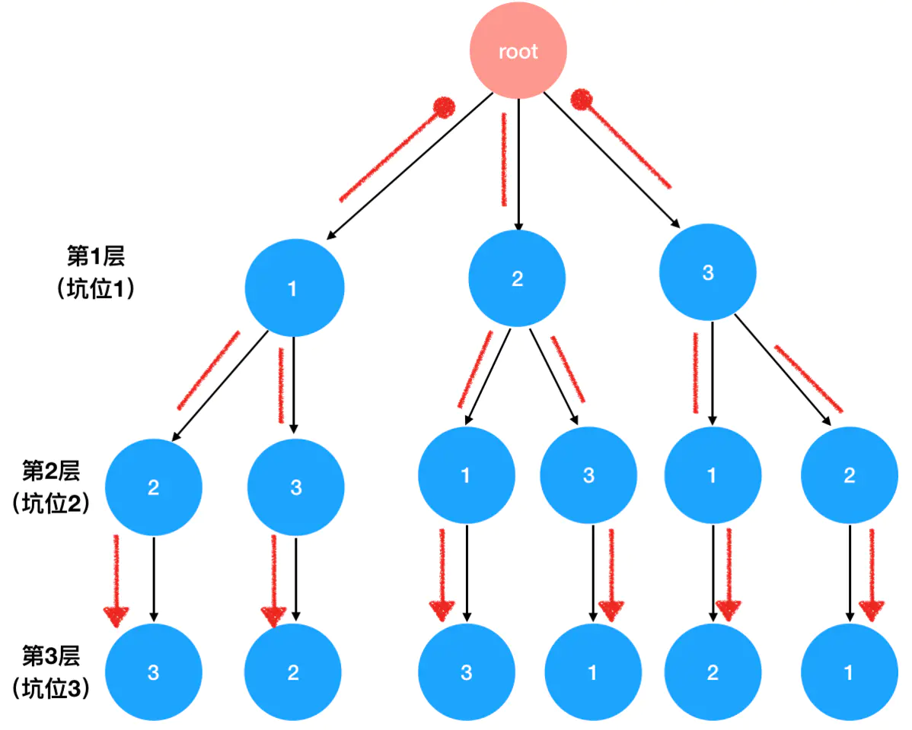
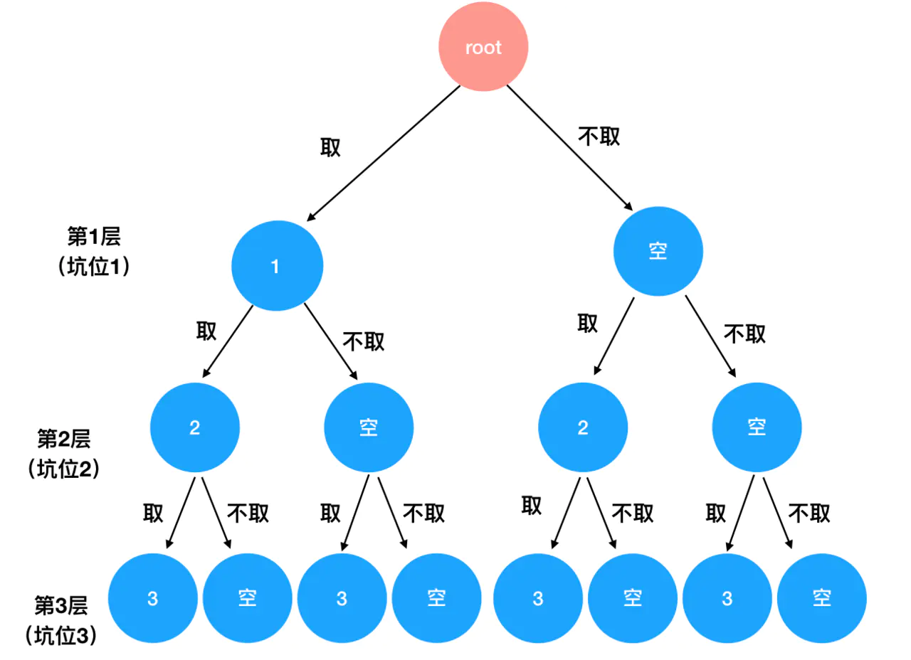
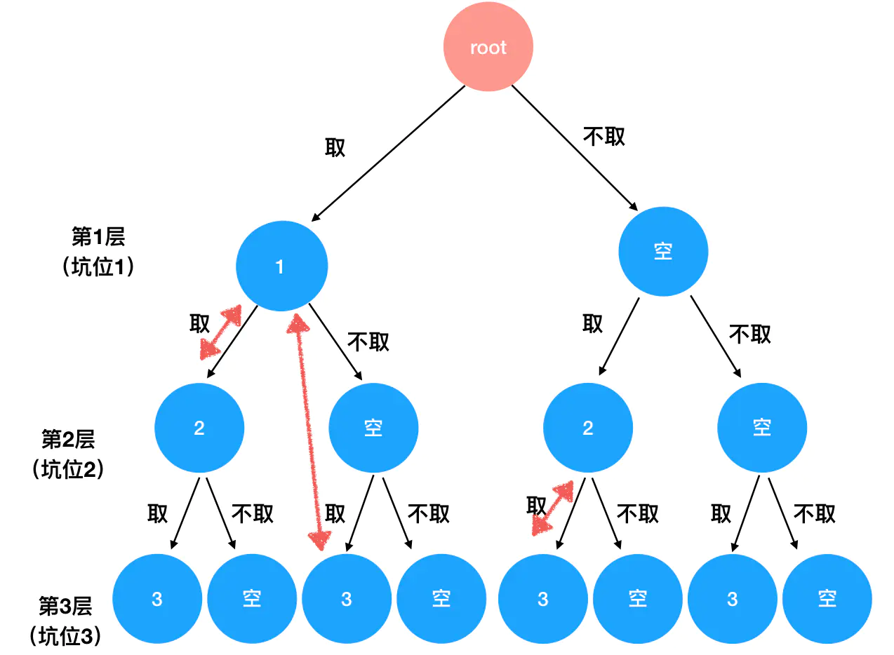

---
tags:
  - algorithm
---

# 递归与回溯思想

回溯算法实际上一个类似枚举的搜索尝试过程，主要是在搜索尝试过程中寻找问题的解，其核心思想是如果发现当前路径已不满足求解条件时，就「回溯」返回，尝试别的路径。

回溯法是一种选优搜索法，按选优条件向前搜索，以达到目标。但当探索到某一步时，发现原先选择并不优或达不到目标，就退回一步重新选择，这种走不通就退回再走的技术为回溯法，而满足回溯条件的某个状态的点称为「回溯点」。许多复杂的，规模较大的问题都可以使用回溯法，有「通用解题方法」的美称。

这里的「回溯」二字可以理解为是在 **DFS 过程中「退一步重新选择」这个动作**， DFS 算法其实就是回溯思想的体现。

:bulb: 回溯算法的基本思想是：从一条路往前走，能进则进，不能进则退回来，换一条路再试。

## 全排列问题
> 题目描述：给定一个**没有重复**数字的序列，返回其所有可能的全排列。
> :bulb: 全排列是指：从 `n` 个不同元素中任取 `m`（m≤n）个元素，按照一定的顺序排列起来，叫做从 `n` 个不同元素中取出 `m` 个元素的一个排列。当 `m=n` 时所有的排列情况叫全排列。即拿到一个 `n` 个元素的数组作为入参，穷举出这 `n` 个数的**所有排列方式**。
>
> 示例：输入：`[1,2,3]`
> 输出：
> ```js
> [
>   [1,2,3],
>   [1,3,2],
>   [2,1,3],
>   [2,3,1],
>   [3,1,2],
>   [3,2,1]
> ]
> ```

可以将问题转换为「填坑」情景。手里有 3 个数，要往这 3 个坑里填，有几种填法？

1. 面对第一个坑，有 3 种选择：填 `1`、填 `2` 或填 `3`，随机选择其中一个填进去即可。
2. 面对第二个坑，由于第一步中已经分出去 1 个数字，现在只剩下 2 个选择。
3. 面对第三个坑，由于前面已经消耗了 2 个数字，此时我们手里只剩下 1 个数字了。所以说第 3 个坑是毫无悬念的，它只有1种可能。



::: info
一个思维工具：只要分析出重复的逻辑（排除掉类似数组遍历这种简单粗暴的重复），需要把**递归**从你的大脑内存里调度出来，将其列为「可以一试」的解法之一，而只要想到递归，就应该立刻想到 [**DFS 思想**](./DFS和BFS.md#深度优先搜索)。
:::

**递归式**：示例的「填坑」过程中重复地做了以下事情

1. 检查手里剩下的数字有哪些
2. 选取其中一个填进当前的坑里

**递归边界**：递归式的动作一直持续到了最后一个数字也被填进坑里为止，可以用数组中可选数字是否为空，或坑位是否已填满来判断是否达到递归边界。

```js
/**
 * @param {number[]} nums
 * @return {number[][]}
 */

function permute(nums) {
  const len = nums.length;
  // 记录当前排列
  let curr = [];
  // 记录所有排列
  let res = [];
  // 使用对象模拟 Map 结构，记录以使用的数字，避免重复使用同一个数字
  let visited = {};

  // 核心函数，遍历数组，生成排列
  // 入参是坑位的索引（从 0 开始计数）
  function dfs(nth) {
    // 当遍历到了不存在的坑位（第 len+1 个），表示到达递归边界
    if(nth === len) {
      // push 当前排列到 res 中，记录当前 len 个坑位已填满的排列
      res.push(curr.slice());   // 使用 slice 创造数组副本，而不是引用
      return   // 返回上一层递归
    }
    // 遍历数组元素，依次以元素作为首个元素生成排列
    for(let i=0; i<len; i++) {
      // 若 visited 该元素并没有标记，对应值为 0，表示该元素可以使用填入当前坑位
      if(!visited[nums[i]]) {
        // 将元素 push 到当前排列中
        curr.push(nums[i]);
        // 为当前使用过的元素打上「已用过」的标，即添加到 visited 中并设置值为 1
        visited[nums[i]] = 1;
        // 递归调用，基于当前排列继续往下一个坑位走去
        dfs(nth+1);
        // 递归返回后（当前的排列完成，由于递归是栈结构层层嵌套，因此只有最深递归结束才依次层层返回）
        // 依次清空各层递归中添加到 visited 中的元素 和 元素的「已用过」标记，以便下一个循环使用
        // nums[i] 让出当前坑位
        curr.pop();
        // 去掉「已用过」标记
        visited[nums[i]] = 0;
      }
    }
  }
  // 从 0 坑位开始调用核心函数 dfs
  dfs(0);
  return res;
}
```

:warning: 模拟 Map 结构 `visited`  的使用：填坑时，每用到一个数字，我们都要给这个数字打上「已用过」的标记，避免它被使用第二次；数字让出坑位时，对应的排列和 `visited`  状态也需要被及时地更新掉。
:warning: 当走到递归边界时，一个完整的排列也到手了。将这个完整排列推入结果数组时，用了 `res.push(curr.slice())` 而不是简单的 `res.push(curr)` 因为全局只有一个唯一的 `curr`，它的值会随着 `dfs` 的进行而不断被更新。 `slice` 方法的作用是帮助我们拷贝出一个不影响 `curr` 正本的副本，以防直接修改到 `curr` 的引用。

## 组合问题
> 题目描述：给定一组不含重复元素的整数数组 `nums`，返回该数组所有可能的子集（幂集）。
> :bulb: 解集不能包含重复的子集。
>
> 示例: 输入: `nums = [1, 2, 3]`
> 输出
> ```js
> [
>   [3],
>   [1],
>   [2],
>   [1, 2, 3],
>   [1, 3],
>   [2, 3],
>   [1, 2],
>   []
> ]
> ```

:bulb: 组合问题返回该数组所有可能的子集，出现穷举大概率会用到 DFS，只要用到 DFS 就应该想到递归思维方式，其中核心是构建**递归式**和定义**递归边界**。

在上一道题中，**排列的顺序是变化的**，而每个排列中数字的个数却是不变的，即「坑位」的个数是确定不变的，可以作为递归边界；在这道题中，每个组合中数字的个数是不确定的（即每个数字在组合中的存在性不确定），但不变的东西变成了**可以参与组合的数字**，因此我们的思路可以调整为，从每一个数字入手，讨论它出现或者不出现的情况。



**递归式**：检查手里剩下的数字有哪些（因为强调了数字不能重复使用），选取其中一个填进当前的坑里、或者干脆把这个坑空出来（这里就体现了存在性而非顺序）。

**递归边界**：组合里数字个数的最大值，如示例只给了 3 个数，因此组合里数字最多也只有 3 个，超过 3 个则视为触碰递归边界，即直接以 for 语句遍历所有的数字作为递归边界，当数组的元素遍历完全时，也就意味着递归走到了尽。。

```js
/**
 * @param {number[]} nums
 * @return {number[][]}
 */

function subsets(nums) {
  const len = nums.length;
  // 记录当前组合
  let curr = [];
  // 记录所有组合
  let res = [];

  // 核心函数，遍历数组，生成组合
  // 入参是 nums 中的数字索引，一般取 index=0 从第一个元素开始遍历
  function dfs(index) {
    // 每次（递归调用）进入函数都意味着当前组合内容更新一次，故直接推入结果数组中
    res.push(curr.slice()); // 使用 slice 创造数组副本，而不是引用
    // 从当前数字的索引开始，遍历 nums
    for (let i = index; i < len; i++) {
      // 这是当前数字存在于组合中的情况
      curr.push(nums[i]);
      // 基于当前数字存在于组合中的情况，进一步 dfs（递归），遍历判断数组下一个元素的存在情况
      dfs(i + 1);
      // 底层递归结束后依次返回，pop 出当前递归层中添加的元素，并作为这是当前数字不存在与组合中的情况，再返回上一层时就可以添加到 res 中
      curr.pop();
    }
  }

  // 从数组第一个元素进入 dfs
  dfs(0);
  return res;
}
```

## 限定组合问题
> 题目描述：给定两个整数 `n` 和 `k`，返回 1~n 中所有可能的 k 个数的组合。
> 示例：输入：`n = 4, k = 2`
> 输出：
> ```js
> [
>   [2, 4],
>   [3, 4],
>   [2, 3],
>   [1, 2],
>   [1, 3],
>   [1, 4],
> ]
> ```

这是组合问题的一种变体，限制了组合中的元素个数，即在深度优先搜索中，要去掉一些不符合题目要求的、没有作用的分支，及时回溯（递归返回），这个过程形似剪掉树的枝叶，所以这一方法被称为「剪枝」。

假如 `n=3， k=2`，那么需要输出的内容就如下图的红色箭头所示



需要基于组合问题对递归式和递归边界进行修改：

**递归式**：当且仅当组合内数字个数为 `k` 个时，才会对组合结果数组进行更新。
**递归边界**：相应地如果组合内数字个数达到了 `k` 个，就不再继续当前的路径往下遍历，而是直接返回。

```js
/**
 * @param {number} n
 * @param {number} k
 * @return {number[][]}
 */

function combine(n, k) {
  // 记录当前组合
  let curr = [];
  // 记录所有组合
  let res = [];

  // 核心函数，遍历数组，生成组合
  // 入参是索引，根据题目要求取 index=1， 遍历由正整数 1~n 组成的数组
  function dfs(index) {
    if(curr.length === k) {
      // 每次（递归调用）进入函数都判断当前组合中的元素个数
      // 当数量为 k 个时，表示达到递归边界，就 push 到 res 中，并返回
      res.push(curr.slice()); // 使用 slice 创造数组副本，而不是引用
      return
    }

    // 从当前数字的索引开始，遍历 index-n 之间的所有数字
    for (let i = index; i <= n; i++) {
      // 这是当前数字存在于组合中的情况
      curr.push(i);
      // 基于当前数字存在于组合中的情况，进一步 dfs（递归），遍历判断数组下一个元素的存在情况
      dfs(i + 1);
      // 底层递归结束后依次返回，pop 出当前递归层中添加的元素，并作为这是当前数字不存在与组合中的情况，再返回上一层时就可以添加到 res 中
      curr.pop();
    }
  }

  // 从数组第一个元素进入 dfs
  dfs(1);
  return res;
}
```

## 解题模板
解题模板解决三个核心问题：

* 什么时候用？（明确场景）
* 为什么这样用？（提供依据）
* 怎么用？（细化步骤）

以下是涉及递归与回溯，或者说涉及 DFS 应用题目的解题模板：

**什么时候用**

看两个特征：

1. 题目中暗示了一个或多个解，并且要求我们**详尽地列举出每一个解**的内容时，一定要想到 DFS、想到递归回溯。
2. 题目经分析后，可以转化为**树形逻辑模型**求解。

**为什么这样用**

递归与回溯的过程本身就是**穷举**的过程。题目中要求我们列举每一个解的内容，解是基于穷举思想、对搜索树进行恰当地剪枝后得来的。

:bulb: 如果题目只问解的个数（不问解的内容），这类问题往往不用 DFS 来解，而是用**动态规划**。

**怎么用**

* 一个模型——树形逻辑模型。树形逻辑模型的构建关键在于找「坑位」，一个坑位就对应树中的一层，每一层的处理逻辑往往是一样的，这个逻辑就是递归式的内容。
* 两个要点——递归式和递归边界。基于在题目中约束得出递归边界，如默认为「坑位」数量的边界。


用伪代码总结一下编码形式：

```js
function xxx(入参) {
  // 前期的变量定义、缓存等准备工作

  // 定义路径栈
  const path = []

  // 定义核心（递归）函数 dfs
  dfs(递归参数) {
    if(到达了递归边界) {
      // 结合题意处理边界逻辑，往往和 path 内容有关
      // 到达递归边界返回（回溯）
      return
    }

    // 注意这里也可能不是 for，视题意决定
    for(遍历坑位的可选值) {
      path.push(当前选中值)
      // 处理坑位本身的相关逻辑
      path.pop()
    }
  }

  // 进入 dfs
  dfs(起点)

  // 返回结果
  return res;
}
```