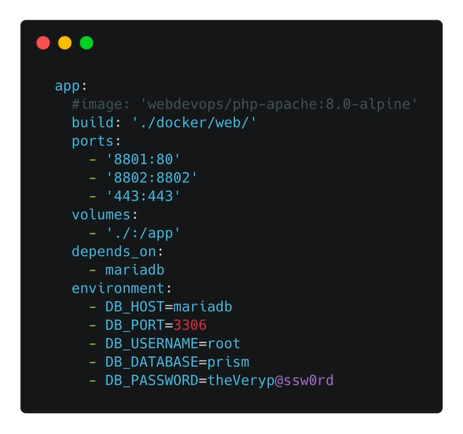

# Docker Compose

一般需要多个容器构建一个项目，每个容器都提供一项服务，可以有效地避免依赖冲突等问题，Docker Compose 是用于管理多个容器的工具，解决顺序依赖、互访问题。

Docker Compose 是一个 YAML 文件 `docker-compose.yml`，以空格为缩进的文件格式。

主要有三部分组成：

* `version` 指定 docker compose 使用哪一个版本的语法
* `Services` 设置多容器中，各个容器的配置信息。每一个容器称为一种服务 service
* `volumes` 设置数据卷

容器（服务）的常见配置参数：

* `image` 或 `build` 指定容器使用的镜像。如果使用 `image` 则会直接从 Registry 拉取镜像；如果使用 `build` 会进入指定的目录中，根据 `dockerfile` 命令创建
* `ports` 设置端口的映射规则
* `volumes` 设置数据卷的映射
* `depends_on` 设置当前服务所依赖的容器，等待依赖服务启动后再执行代码
* `environment` 设置容器的环境变量