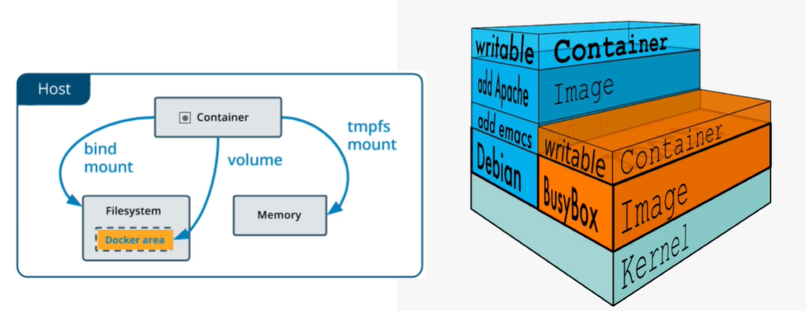
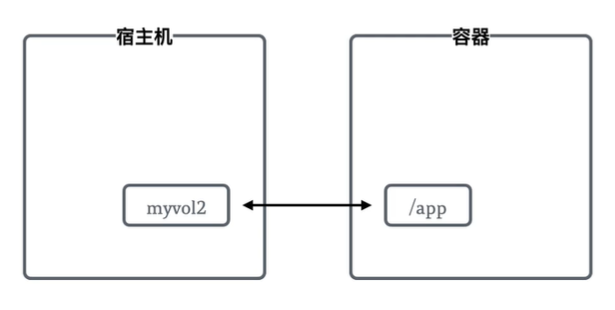

# Docker 基本命令

可以通过 `--help`  参数来查看 Docker 创建命令

* `docker --help`
* `docker container --help` 容器相关的命令
* `docker images --help`

## 创建容器

```bash
docker run <ImageName>
```

:bulb: 以上命令会运行镜像 `ImageName` 并创建一个**新容器**，如果容器中的命令执行完成就会退出容器。推荐预先将镜像下载到本地，以加速创建运行过程。

* 可以使用参数 `--name ContainerName` 指定创建的容器的名称
* 可以使用参数 `--rm` 设置容器退出后自动删除


## 管理容器

* `docker ps` 列出所有正在运行的容器，使用参数 `-a` 可以查看所有容器（包括运行过的和正在运行的容器）

  ```bash
  CONTAINER ID   IMAGE     COMMAND                  CREATED         STATUS                     PORTS     NAMES
  36f547c36763   php       "docker-php-entrypoi…"   4 minutes ago   Exited (0) 4 minutes ago             php1
  7f6293711fb0   php       "docker-php-entrypoi…"   5 minutes ago   Exited (0) 4 minutes ago             focused_haslett
  ```

  其中 `CONTAINER ID` 是容器的 ID 值，可以用在其他命令中指明要操作的具体容器，如果创建容器时没有使用参数 `--name` 指定容器名称，Docker 会自动生成 `NAMES` 属性

* `docker start <CONTAINER ID>` 启动已有的容器

* `docker stop <CONTAINER ID>` 停止正在运行的容器

* `docker rm <CONTAINER ID>` 删除指定的容器，如果需要删除正在运行的容器，需要添加参数 `-f`

* `docker container prune` 删除所有已停止的容器

* `docker rename` 重命名容器

* `docker cp` 复制容器

* `docker exec` 运行命令，运行结束后就退出

* `docker commit <CONTAINER ID>` 从容器创建新镜像（容器在命令运行结束后会退出，为了持久化，可以基于容器创建一个新镜像），然后终端会返回一个该镜像的 ID。推荐给镜像命名并打上标签，便于识别

  ```bash
  docker tag <ImageID> <ImageName>:<TagName>
  ```

* `docker build` 读取 `dockerfile` 创建一个新镜像

:bulb: 参考 Linux 系统常见操作命令


## 镜像管理

* `docker images` 镜像列表
* `docker rmi` 镜像删除
* `docker image prune` 删除停止的镜像，如果添加参数 `-a` 会删除所有未被其他镜像引用过的镜像
* `docker save` 将镜像保存为压缩文件格式
* `docker load` 从压缩文件中提取出镜像
* `docker pull` 从 Registry 中拉取镜像到本地，可以从官方提供的仓库 [dockerhub](https://hub.docker.com/) 中检索所需的镜像
* `docker push` 从本地将镜像推送到 Registry
* `docker tag` 为镜像打标签（一般用于标记版本）


## 查看信息和状态

* `docker logs <ContainerID>` 查看 docker 日志
* `docker stats` 查看 docker 状态
* `docker version` 查看 docker 版本
* `docker top` 查看 docker 当前运行的进程
* `docker inspect <ContainerID>` 查看 docker 元数据
* `docker diff <ContainerID>` 查看容器中修改的内容
* `docker port <ContainerID>` 查看容器的端口映射


## 数据卷管理

为了将容器数据持久化，数据卷支持将容器保存到文件系统中，或是从文件系统/内存中读取容器。这样也就实现了**宿主机（本地）数据与容器的数据的实时共享**，如果将同一数据卷挂载到多个容器中，就可以实现多个容器的数据共享。



* `docker volume create <volumeName>` 创建数据卷
* `docker volume ls` 列出所有数据卷
* `docker volume inspect` 查看数据卷的元信息
* `docker volume rm` 删除数据卷


数据卷是创建在宿主机中的，需要在运行 Docker 时将他它映射到容器的相应目录，以下命令创建一个名为 `myvol2` 的数据卷，使用参数 `-v` 指定目录对应关系。

```bash
docker run -d --name devtest -v myvol2:/app nginx:latest
```



