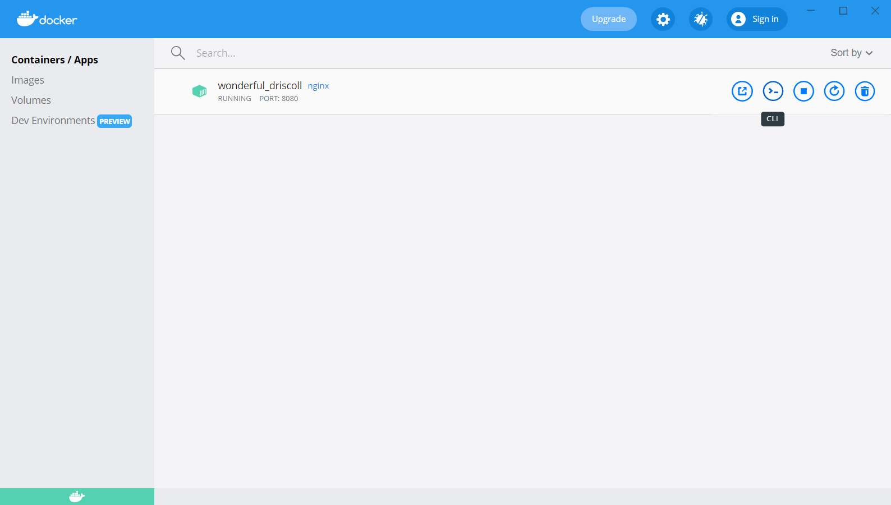
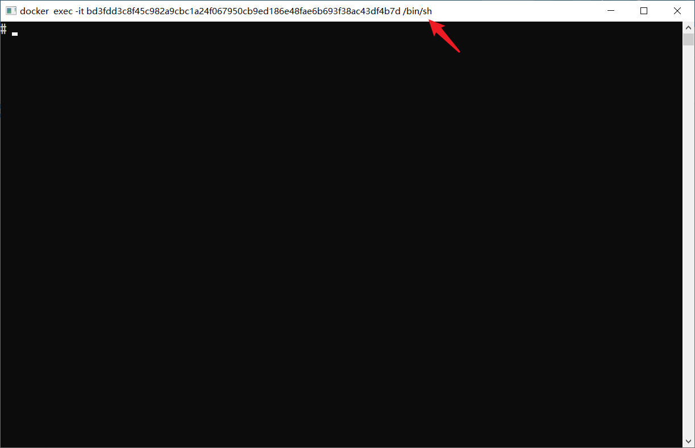

# Docker 常见场景

Docker 中常见场景的操作步骤

## 操作容器内容

* 使用 `docker exec -it` 以交互的方式进入容器，然后一般在容器内启动 bash 或 shell 应用（一般这些应用在 Linux 系统的路径是 `/bin/`），这样在当前终端输入的代码，就可以在容器中执行

  ```bash
  docker exec -it <ContainerName> /bin/bash
  ```

* 创建一个文件：在目录 `home` 下创建一个文件 `hw.txt`，其内容是 `HelloWorld`

  ```bash
  cd home
  ls
  echo "HelloWorld" > hw.txt
  cat hw.txt
  exit
  ```


:bulb: 可以使用 Docker Desktop 快捷进入容器中




