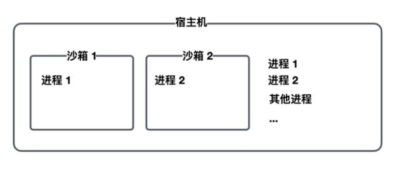
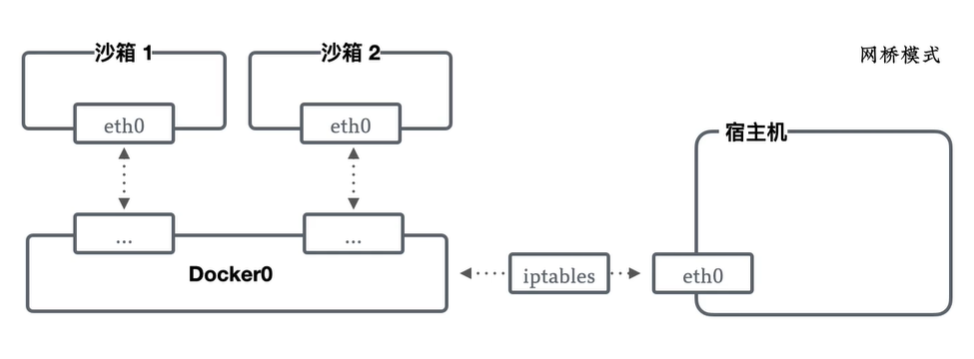
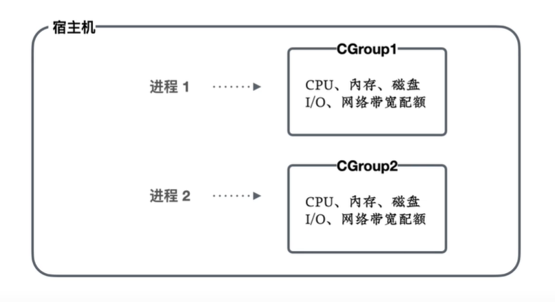
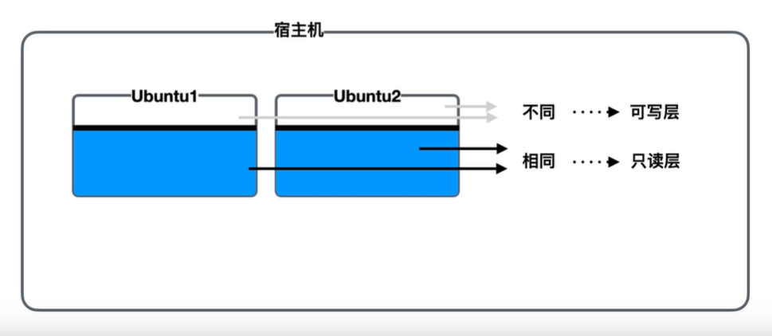
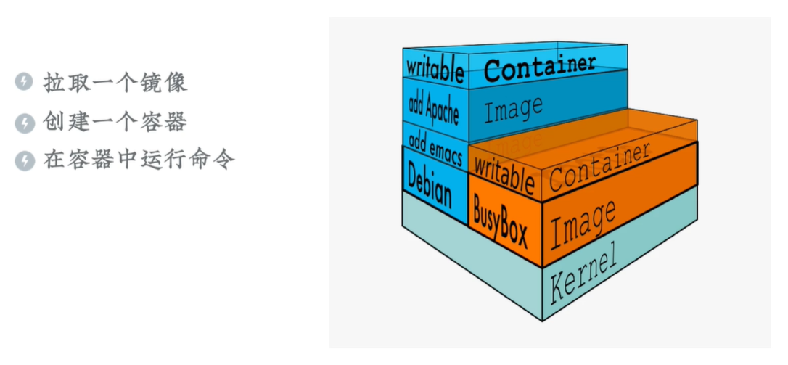
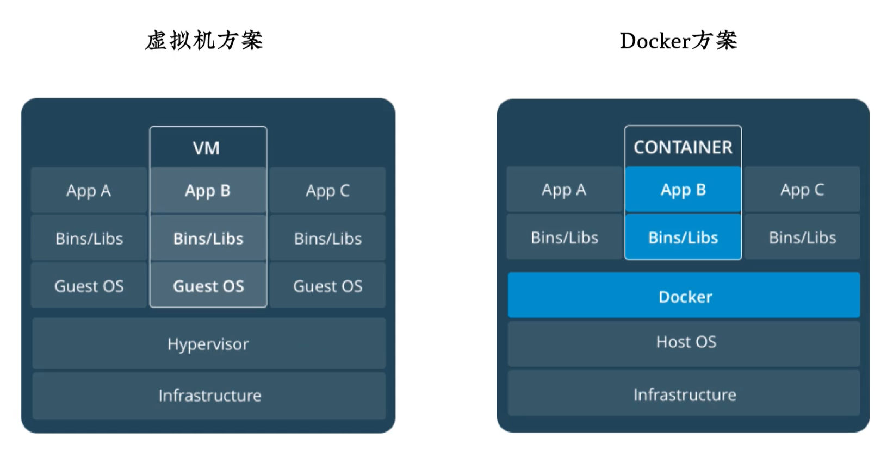

# Docker 简介

## 原理

Docker 使用 Linux 中各种隔离技术，为每一个进程提供一个独立的容器：

* Namespaces：为进程树、网络接口、挂载点进行隔离，实现进程间的通信
* CGroups：隔离 CPU、内存、磁盘 I/O、网络带宽
* Unionfs：联合文件系统、镜像

### Namespaces

NameSpaces 工具可以对进程进行隔离

宿主机是运行着 Docker 引擎的主机，沙箱即容器，通过 Docker 创建的隔离的空间，独立地运行着各种进程。

通过**网桥模式**对网络进行隔离：为每一个容器创建一个虚拟网卡

### CGroups

CGroups 工具隔离共享的资源，如 CPU、内存、磁盘 I/O、网络带宽等，而每一容器进行配容，限制其调用共享资源的额度。

### Unionfs

Unionfs 将文件系统中相同部分和不同部分分别处理，然后通过联合文件系统将这些文件以叠加的方式挂载起来，构成一个完整的文件系统供不同容器使用，同时节省出大量的磁盘空间。

文件系统中只读层称为**镜像**，可写层称为**容器**。

:bulb: Docker 提供一个容器，相对于虚拟机更有优势。

虚拟机方案：对于每个虚拟机都需要一个独立的操作系统 Guest OS

Dock 方案：共享一个系统 Host OS，通过 Docker 引擎为每一个用户分配独立的容器，更节省资源

:bulb: 虚拟机有一个独立的操作系统，启动后会一直运行；Docker 则在命令运行结束后就退出容器，下次需要执行命令时，再重新创建容器。

## 架构

Docker 的基本架构是 Client-Server 客户端-后台结构

* Client 与用户进行交互，接受输入命令，管理容器、镜像，还有运行程序
* Server 创建容器，需要先拉取镜像，优先从本地拉取，本地没有就到 Registry 拉取
* Registry 镜像托管仓库