# Github基础

参考：
- http://up-for-grabs.net/
- http://www.firsttimersonly.com/
- [GitHub 上的（仅）初学者标签](https://github.com/search?utf8=✓&q=label%3Afirst-timers-only+is%3Aopen&type=Issues&ref=searchresults)
- [「仅初学者」博文](https://medium.com/@kentcdodds/first-timers-only-78281ea47455)
- [Git Community Book 中译版](http://gitbook.liuhui998.com/index.html)
- [git-tips](https://github.com/git-tips/tips)（[中译版](https://github.com/521xueweihan/git-tips)）
- 查看开发者的[第一个 Pull Request](http://firstpr.me/)

托管 Git 项目的方式有多种，目前最受欢迎的托管网站是 [GitHub](https://github.com/)

## 访问远程仓库
通过位于 Web 上的**仓库的 URL** 和 Git 远程命令 `git remote` 访问远程仓库并进行交互。

**远程仓库的简写名 Shortname**
将远程仓库克隆到本地后，该仓库会（通过 URL）与远程仓库绑定，运行命令 `git remote` 会返回远程仓库的简写名（通常命名为 `origin`）。简写名是**远程仓库路径**的简略表示。简写名仅局部用于当前仓库（如在你的本地仓库中）。

示例

* 命令 `git remote`  设置选项 `-v` 返回远程仓库的简写名及其所指的完整路径（即 URL）
* 使用命令 `git remote rename <origin_name> <new_name>` 重命名远程仓库简写名

## 创建远程仓库
从主页创建仓库可下拉导航栏标签创建或点击页面的 `New` 按钮

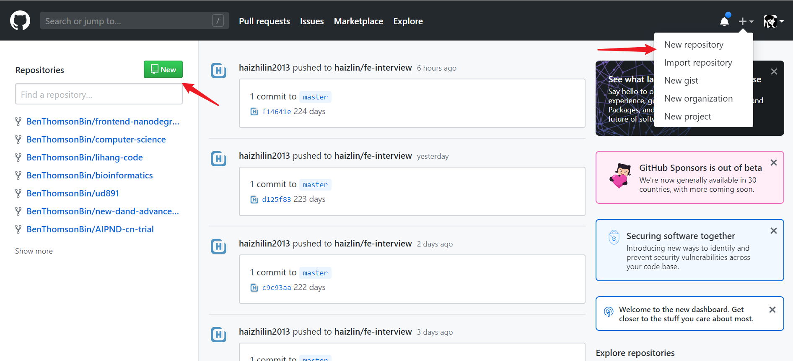

在创建仓库设置仓库名称 Repository name 等相关信息。一般使用项目名称作为仓库的名称。

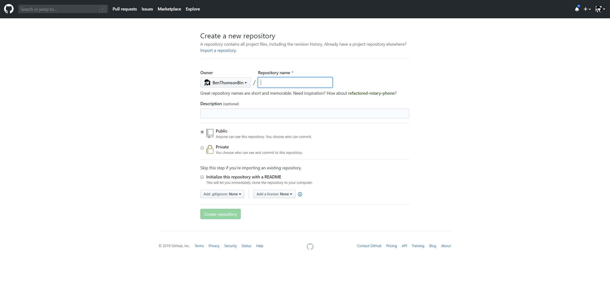

:warning: 当本地等待 `push` 的仓库已经有了 README 文件时，创建仓库时应取消勾选 `Initialize this repository with the README`（使用 README 初始化此仓库）选项

当新建仓库未初始化，显示出仓库的设置页面 `Quick setup`，根据本地仓库情况和提示进行操作

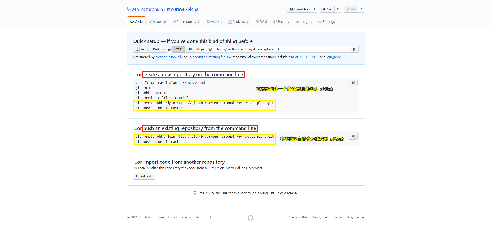

* 命令 `git remote add origin <URL>` 创建了一个简写名 `origin` （也可以设置为其他名称），并指向远程仓库完整路径（一般是 Web 上的远程仓库 URL）。添加远程仓库的路径，以在本地仓库与远程仓库之间建立连接。
* 使用命令 `git remote -v` 查看远程仓库与本地仓库之间连接信息

## 推送更改至远程仓库
命令 `git push <remote-shortname> <branch>` 将本地 commit 推送到远程仓库，要提供**远程仓库简写名**以及用于容纳该 commit 的远程仓库的**分支名**。

将当前本地仓库推送到简写名为 `origin` 的远程仓库的 `master` 分支

* 将本地 commit 推送到远程仓库可能需要输入用户名和密码，这取决于你如何配置 GitHub 的以及使用的远程 URL 。
    - 如果配置 GitHub 使用 HTTP 协议，就需要提供用户名和密码。如果你的密码出错，不用担心，它会让你重新输入
    - 如果配置 GitHub 使用 SSH 协议，并提供过 SSH 密匙，则不需要提供密码。参阅 GitHub 文档 [使用 SSH 连接](https://help.github.com/articles/connecting-to-github-with-ssh/)。
* Git 会压缩文件使之变小，然后将其推送至远程仓库
* 示例输出表示创建了一个新分支 `[new branch]`，后面是表示本地分支推送到远程仓库的分支 `master -> master`

:warning: 远程仓库的 URL 包含项目所在帐户的用户名，而该用户名为仓库的所有者，提交 `push` 到该仓库需要提供该用户名和相应密码才有权限对远程仓库进行修改

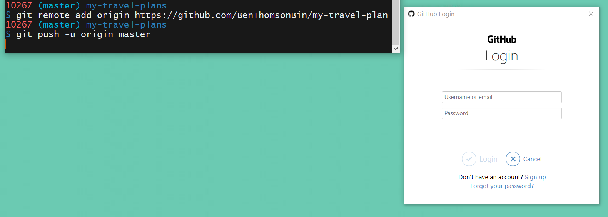

当把本地 commit 推送到远程仓库后，会出现跟踪分支（其名称由远程仓库的简写名及分支名称组成），以跟踪（同步）远程仓库中的相应分支。示例中的跟踪分支表示当前远程仓库 `origin` 有一个 `master` 分支指向 commit `d2227cc`（**并包含 `d2227cc` 前的所有 commit **），这意味着可以在本地仓库跟踪远程仓库的信息。但需要注意的一点是，这个跟踪分支并**不能实时表现**在远程仓库上的位置。如果我们之外的其他人对远程仓库做了更改，我们本地仓库中的跟踪分支不会移动，必须告诉它检查更新/同步**它才会**移动。

## 查看远程仓库
推送 commit 至远程仓库后，Github 会在项目主页显示关于仓库的信息可供查阅。GitHub 有一个很棒的功能，即它会**自动显示 README 文件的内容**。

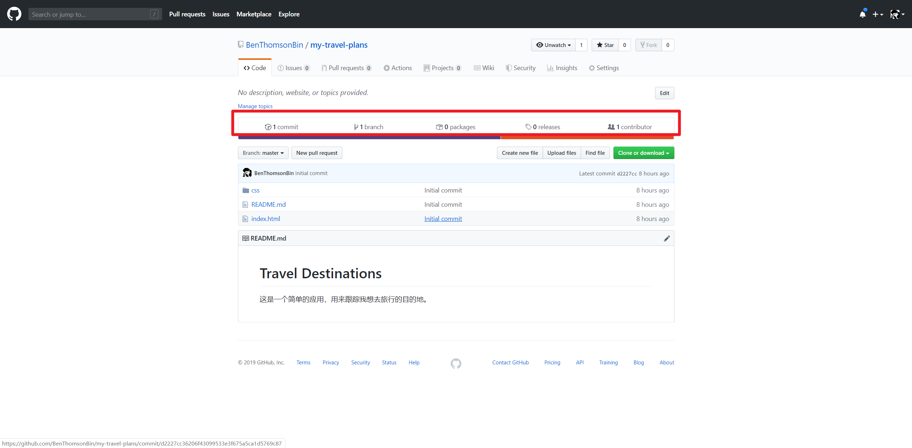

该示例中的 GitHub 显示当前仓库中有一个个 commit、一个分支、一名贡献者

## 从远处仓库拉取修改
当远程仓库上存在一些 commit ，但我们的本地仓库上没有这些 commit ，为了将与远程仓库上的更改同步，需要使用命令 `git pull <remote-shortname> <branch>` 同步**远程**仓库与**本地**仓库，与命令 `git push` 类似，但是方向相反，拉取远程仓库的 commit 到本地并与本地分支合并。

检索 origin 远程仓库 master 分支中的 commit 并将。

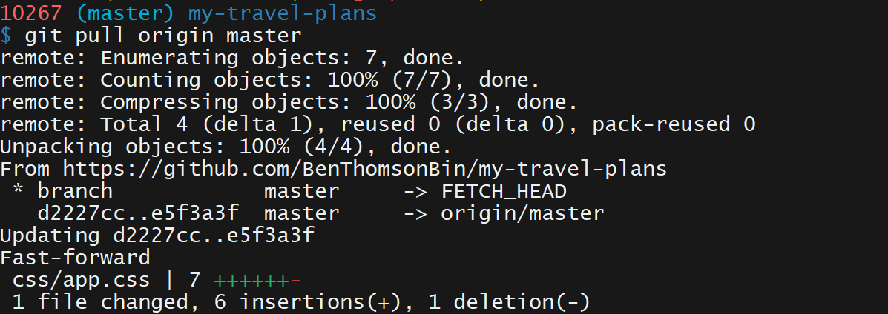

* 远程分支上的 commit 会被复制到本地仓库
* 本地跟踪分支 `origin/master` 移到指向最新的 commit
* 本地跟踪分支 `origin/master` 合并到本地分支 master
* 输出 `fast-forward` 表示 Git 进行了**快进合并**，并输出类似于 `git --stat` 的信息，显示更改的文件及添加或删除了多少行

命令 `git fetch <remote-shortname> <branch>`  也可以从远程仓库分支检索 commit 并下载到本地，但**不会**自动将本地分支与远程跟踪分支**合并**。只是将跟踪分支指向最新的 commit，而当前分支并不移动。使用 `git fetch` 而不是 `git pull` 的一个主要情形是当你的远程分支和本地分支都拥有对方所没有的更改时，直接合并会出现合并冲突。可以将 `git fetch` 想象成 `git pull` 它的一半操作，先获取远程更改，将它们存储到本地分支中，然后再使用命令 `git merge <branch>`手动执行合并。

:cinema: [git fetch 演示视频](https://www.jianguoyun.com/p/DajSvLgQjNDGBxjS-uAD)

## fork 仓库
在版本控制术语中，fork 一个仓库是指复制它。当你 fork 仓库时会创建与原始仓库完全相同的副本，新副本也是一个远程仓库，并将该副本移动到你的帐户，你对 fork 的仓库拥有完全控制权（与之相对应的是克隆，克隆仓库发生在本地计算机上，将远程仓库复制到本地，获得完全一样的仓库副本）。

fork 项目后你的 GitHub 配置文件名称旁边会显示新的项目名称。此外，名称下面还会说明原始项目所在的位置。可以 fork GitHub 上的任何公共仓库，并对获得的副本拥有完全控制权。

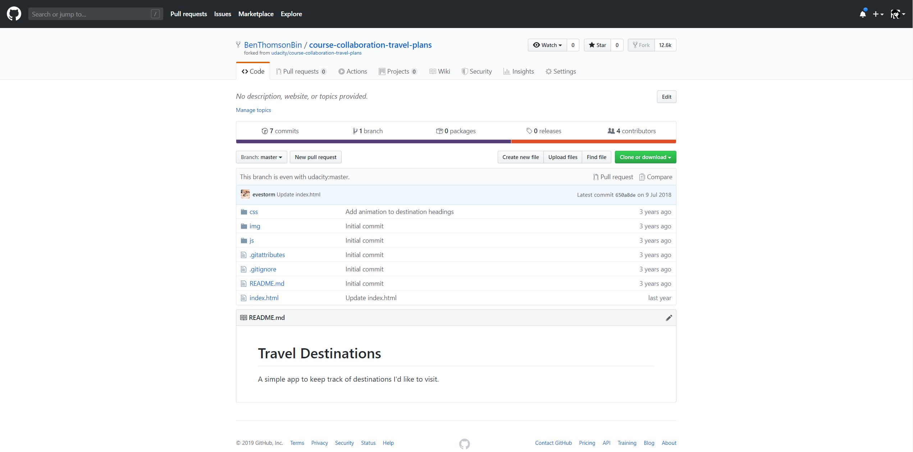

* fork 并非 Git 子命令
* 修改 fork 的仓库不会更改原始仓库

## 查看其他开发者的 commit
在与他人开发者协作时，使用命令 `git shortlog` 按作者对 commit 分组排序列出所有提交。还可以设置选项 `-s` 仅显示 commit 的数量，设置选项 `-n` 按数量排序（而不是按作者姓名的字母顺序）。

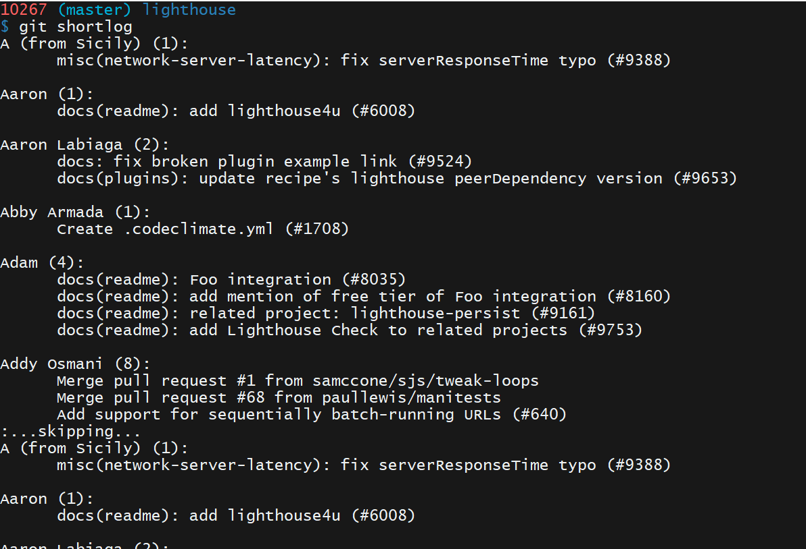

命令 `git log` 设置不同的选项可按不同需求查询 commit

* 设置选项 `--author=name` 筛选作者名称与 `name` 相匹配所有的 commit
* 设置选项 `--grep key_word` 或 `--grep=key_word` 筛选提交信息与关键字 `key_word` 相匹配的所有 commit（:bulb:Grep 是一个模式匹配工具:bulb:，如运行 `git log --grep "fort"` 则 Git 将显示顺序包含字符 `f`、`o`、`r`、`t` 的 commit，可能是一个单词，也可能是单词里的一个片段相匹配即可 ）

:warning: 空格是查询时的一个问题，如果尝试搜索包含多个词且单词之间有空格的作者或内容，则需要将空格也包含在引号内。例如，要搜索 `unit tests`，你需要使用以下命令 `git log --grep="unit tests"`

## 拉取请求Pull Request
拉取请求 Pull Request 是向初始或源仓库的维护者发出的请求，以让其将你在他们项目的 fork 上所做的更改应用在他们的项目中。你请求他们拉取你做的更改。

要创建 Pull Request，你需要完成一些操作：
* 你必须 fork 源仓库
* 将你的 fork 克隆到你的计算机
* 进行一些 commit（最好是在特性分支上！）
* 将 commit 推送回你的 fork
* 创建一个新的 Pull Request，并选择包含你的新 commit 的分支。

:cinema: [创建 Pull Request](https://www.jianguoyun.com/p/DSSbTUkQjNDGBxjP-uAD)

* 当创建一个 Pull Request 时，要将所有更改放在一个专用于这些更改的特性分支上
* 查看 GitHub 中的 Conversation 对话选项卡，可以与项目维护者进行沟通，以明确他们希望你做什么
* 如果需要更改 Pull Request 一般按照以下步骤
    * 在你的 Pull Request 所基于的本地仓库的同一分支上添加一些必要 commit
    * 将该分支推送到你的源仓库 fork 副本

## 与源项目保持同步
### Star
在仓库主页点击 Star 按钮可收藏该项目，Star 是能帮助你跟踪感兴趣仓库的一个有用功能，同时也成为了衡量仓库受欢迎程度的手段。但是如果想实时跟进仓库的发展就不行了，你得手动前往收藏页面查看仓库，以检查它们是否发生变化。

### Watch
如果你要跟进一个项目的变化，并希望接收变更通知，GitHub 为你提供了 Watch 按钮以关注该仓库。这样当该仓库发生任何活动时，GitHub 都会通知你，例如当有人向仓库推送变更，创建了新的 Issues，或者在现有 Issues 中添加了评论。

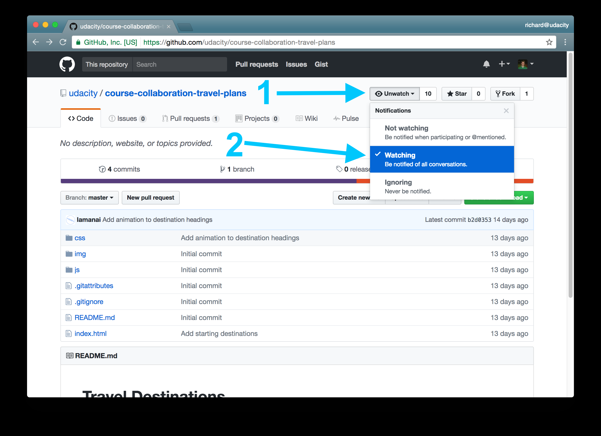

## 加入源仓库更改
假使源仓库开始对项目进行更改了（而 fork 中不会获得这些更改），为了本地克隆仓库保持同步，需要将源仓库的项目添加为额外远程仓库以便保持同步。使用命令 `git remote add` 命令向本地仓库添加一个新的简写名（一般使用 `upstream` 表示引用源仓库）和 URL，将与源仓库之间建立连接。

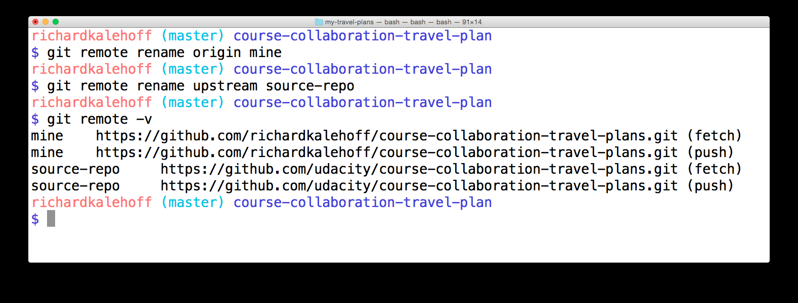

接着使用命令 `git pull <remote-shortname> <branch>` 或 **`git fetch <remote-shortname> <branch>`（推荐使用）** 获得上游远程仓库的更改，注意简写名应使用引用源仓库的简写名

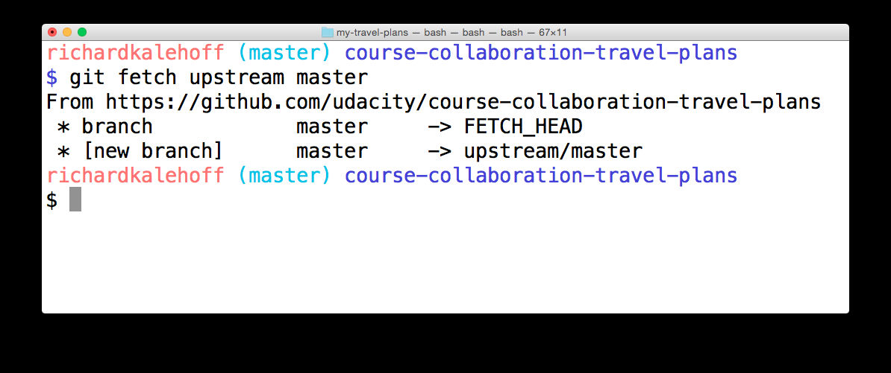
从上游远程仓库获取了所有更改，并存放于本地仓库的新分支 `upstream/master`之中

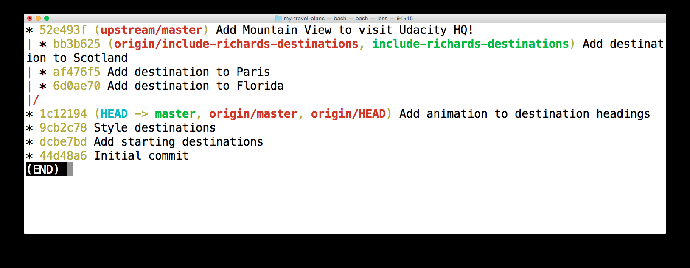

本地仓库中多出了 `upstream/master` 跟踪分支，该分支跟踪**源仓库** master 分支的位置，即获取对源仓库的master 分支所做的更改

一般需要将源仓库的更新合并到本地分支默认分支，以便在默认分支上的开发环境是与源仓库同步的，使用命令 `git merge <branch_name>`。同样为了保持 fork 仓库也进行同步，最后把本地整合了最新更新的分支 push 到远程仓库

